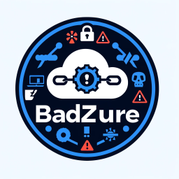
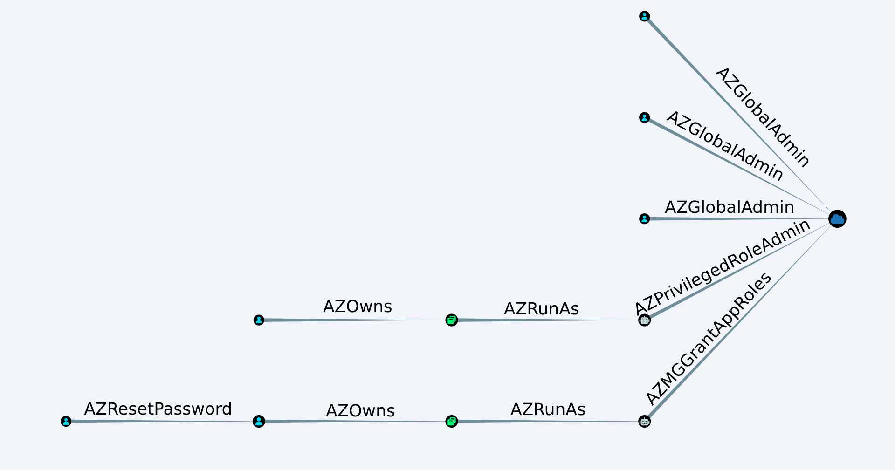

# BadZure
[](https://twitter.com/OTR_Community)

<div align="center">
    
</div>
<br>

BadZure is a Python tool that utilizes Terraform to automate the setup of Azure Active Directory (now Entra ID) tenants, populating them with various entities and introducing common security misconfigurations to create vulnerable tenants with multiple attack paths.

BadZure automates the creation of various entities, including users, groups, application registrations, service principals, and administrative units. To simulate common security misconfigurations in real environments, it randomly assigns Azure AD roles, Graph permissions, and application ownership privileges to selected security principals, enabling the creation of unique attack paths. Adhering to the 'Assume Breach' principle, BadZure offers users two methods of initial access to the vulnerable tenants it creates, thereby simulating account takeover scenarios.

The key advantage of BadZure is its ability to quickly populate and purge Azure AD tenants with randomly generated vulnerable configurations and pre-configured initial access, facilitating continuous and iterative attack simulation and detection development experimentation. It is designed for security practitioners interested in exploring and understanding Azure AD security.

## Goals / Use Cases

BadZure was initialy written to host the [Azure AD Battle School: Hands-on Attack and Defense](https://www.x33fcon.com/#!s/MauricioVelazco.md) workshop at X33fcon 2023.

An Azure AD tenant populated with BadZure also enables red and blue teams to:

* Experiment with common Azure AD attack vectors and tools
* Quickly stand up misconfigured Azure AD lab tenants.
* Obtain attack telemetry to build, test and enhance detection controls
* Execute purple team exercises in a safe setting
* Faciliate hands-on Azure AD security training
* Host dynamic Azure AD Capture the Flag (CTF) events

## Attack Paths

### Initial Access

BadZure simulates initial access by employing common account takeover techniques, including password attacks and token theft. By providing both passwords and tokens, BadZure enables security practitioners to effectively simulate initial access scenarios and explore various attack vectors against Azure AD tenants.

#### Password-Based Access

When configured to use passwords, BadZure assigns randomly generated passwords to key user accounts that are part of the attack paths. These passwords are provided to BadZure users to simulate password-based attacks, such as [credential stuffing](https://owasp.org/www-community/attacks/Credential_stuffing) or [password spraying](https://owasp.org/www-community/attacks/Password_Spraying_Attack). Additionally, BadZure automatically generates a users.txt file containing the usernames of all created accounts, facilitating testing strategies like password spraying.

#### Token-Based Access

For token-based access, BadZure generates JWT access tokens for specified principals. These tokens are provided in the output, simulating scenarios where an attacker has obtained valid tokens through [reverse proxy phishing](https://help.evilginx.com/), [endpoint malware](https://mrd0x.com/stealing-tokens-from-office-applications/) or [device code phishing](https://aadinternals.com/post/phishing/). Users can utilize these tokens to authenticate directly against Azure AD resources, gaining an understanding of potential attack vectors involving token theft.


### Privilege Escalation

BadZure simulates privilege escalation by introducing misconfigurations within Azure AD roles, Graph API permissions, and application ownerships. These misconfigurations include assigning high-privilege roles to service principals or users, granting extensive Graph API permissions to applications, and configuring users as owners of privileged applications. These settings allow for the configuration of [service principal abuse](https://posts.specterops.io/azure-privilege-escalation-via-service-principal-abuse-210ae2be2a5) attack scenarios.

A BloodHound-generated graph, showcasing the attack paths BadZure can create, is shown below.



## Demo

[](https://www.youtube.com/watch?v=&t=746s)


## Quick Start Guide

### Requirements

- **Azure CLI**: Follow the instructions [here](https://docs.microsoft.com/en-us/cli/azure/install-azure-cli) to install Azure CLI.
- **Terraform**: Follow the instructions [here](https://learn.hashicorp.com/tutorials/terraform/install-cli) to install Terraform.

### Create an Azure AD Tenant 

[Creating an Azure subscription](https://learn.microsoft.com/en-us/training/modules/create-an-azure-account/1-introduction) will also provide you an Azure AD tenant. 

**Note:** Utilizing BadZure within your Azure subscription won't lead to any additional costs as it only requires an [Azure AD Free license](https://azure.microsoft.com/en-us/free/).

### Clone Repository

````shell
git clone https://github.com/mvelazc0/BadZure
cd BadZure
````

### Create virtual environment and install dependencies

```shell
# Create a virtual environment
python -m venv venv

# Activate the virtual environment
# On Windows
venv\Scripts\activate

# On Unix or MacOS
source venv/bin/activate

# Install dependencies
pip install -r requirements.txt
```
### Login to Azure as a Global Administrator

```shell
az login
````

### Create and destroy vulnerable tenants

````shell
# Display the help menu
python badzure.py --help

# Populate a tenant and configure all attack paths using the default badzure.yml config file
python badzure.py build

# Populate a tenant and configure all attack paths with a different config file
python badzure.py build --config config.yml

# Show the created resources in Azure AD tenant 
python badzure.py show

# Destroy all created identities with verbose logging
python badzure.py destroy --verbose

````

## YAML Configuration File

BadZure leverages a configuration file used to configure the setup of the Azure AD tenant. This file allows users to specify details such as the number of users, groups, applications, administrative units, and attack paths to be created.

### Example Configuration

```yaml
tenant:
  tenant_id: "your-tenant-id"
  domain: "your-domain.com"
  users: 30
  groups: 10
  applications: 10
  administrative_units: 10

  attack_path_1:
    enabled: true
    initial_access: password 
    privilege_escalation: ServicePrincipalAbuse
    method: AzureADRole
    entra_role : random

  attack_path_2:
    enabled: true
    initial_access: token
    privilege_escalation: ServicePrincipalAbuse
    method: GraphAPIPermission
    app_role : random 

```

For more details on the configuration options, please refer to the [Wiki](https://github.com/mvelazc0/BadZure/wiki/YAML-Configuration-Guide)

## Author

* **Mauricio Velazco** - [@mvelazco](https://twitter.com/mvelazco)

## Contributors

* [Chan Huan Jun](https://www.linkedin.com/in/chan-huan-jun-50a704115/) 

## References

* [Cloud Katana](https://github.com/Azure/Cloud-Katana) by [Roberto Rodriguez](https://twitter.com/Cyb3rWard0g)
* [AADInternals](https://github.com/Gerenios/AADInternals) by [Nestori Syynimaa](https://twitter.com/DrAzureAD)
* [Azure Attack Paths](https://cloudbrothers.info/en/azure-attack-paths/) by [Fabian Bader](https://twitter.com/fabian_bader)
* [ROADtools](https://github.com/dirkjanm/ROADtools) by [Dirkjan Mollema](https://twitter.com/_dirkjan)
* [PurpleCloud](https://github.com/iknowjason/PurpleCloud) by [Jason Ostrom](https://twitter.com/securitypuck) 
* [Azure AD - Attack and Defense Playbook](https://github.com/Cloud-Architekt/AzureAD-Attack-Defense) by [Sami Lamppu](https://twitter.com/samilamppu) and [Thomas Naunheim](https://twitter.com/Thomas_Live)
* [BloodHound/AzureHound](https://github.com/BloodHoundAD/AzureHound) by [Andy Robbins](https://twitter.com/_wald0) 
* Blog posts, talks and tools by [@Haus3c](https://twitter.com/Haus3c), [@kfosaaen](https://twitter.com/kfosaaen), [@inversecos](https://twitter.com/inversecos) and others.

## License

This project is licensed under the Apache 2.0 License - see the [LICENSE](LICENSE) file for details
