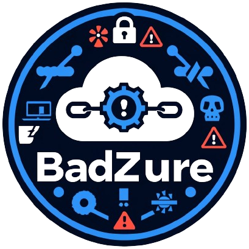
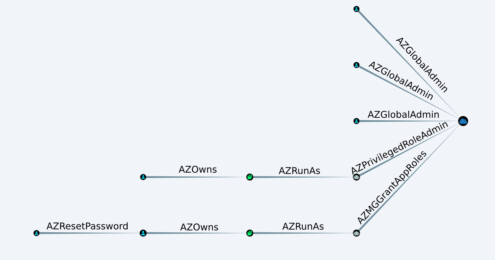

# BadZure
[](https://www.blackhat.com/us-24/arsenal/schedule/index.html#badzure-simulating-and-exploring-entra-id-attack-paths-39628)
[](https://twitter.com/OTR_Community)
[](https://mvelazc0.github.io/BadZure/)

<div align="center">
    
</div>
<br>

BadZure is a Python tool that automates the creation of misconfigured Azure environments, enabling security teams to simulate adversary techniques, develop and test detection controls, and run purple team exercises across Entra ID and Azure infrastructure. It uses Terraform to populate Entra ID tenants and Azure subscriptions with entities and intentional misconfigurations, producing complete attack paths that span identity and cloud infrastructure layers.

BadZure automates the creation of users, groups, application registrations, service principals, administrative units, and Azure resources such as Key Vaults, Storage Accounts, Virtual Machines, Logic Apps, Automation Accounts, Function Apps, Cosmos DB Accounts, and Resource Groups. To simulate a realistic tenant, it randomly assigns Entra ID roles, Graph permissions, and Azure resource access permissions to selected security principals, mimicking the organic permission sprawl found in real environments. On top of this realistic baseline, BadZure layers intentional misconfigurations through configurable attack paths, producing exploitable privilege escalation chains for adversary simulation.

The key advantage of BadZure is its ability to quickly populate and purge tenants with configurations, pre-configured initial access, and intentional attack paths, facilitating continuous and iterative adversary simulation and detection development. It is designed for security practitioners interested in exploring and understanding Entra ID and Azure security, cloud resource misconfigurations, and modern cloud-native attack techniques including certificate-based authentication abuse and managed identity privilege escalation.

## Goals / Use Cases

BadZure was initially written to host the [Azure AD Battle School: Hands-on Attack and Defense](https://www.x33fcon.com/#!archive/2023/s/MauricioVelazco.md) workshop at X33fcon 2023.

An Azure environment populated with BadZure now enables red and blue teams to:

* Experiment with common Entra ID attack vectors and modern cloud infrastructure attack techniques
* Quickly stand up Azure tenants with intentional attack paths and misconfigured cloud resources
* Obtain comprehensive attack telemetry across identity and infrastructure layers to build, test and enhance detection controls
* Execute purple team exercises covering both traditional identity attacks and cloud-native compromise scenarios in a safe setting
* Facilitate hands-on Entra ID and cloud security training with attack paths
* Host dynamic Azure cloud security Capture the Flag (CTF) events with multi-vector attack scenarios

## Attack Paths

### Initial Access

BadZure creates attack paths that assume the initial access identity has already been compromised. Each attack path begins with a compromised user account or service principal, simulating real-world scenarios where an attacker has gained access through credential theft, phishing, adversary in the middle, or other initial access techniques.

BadZure provides the credentials for these compromised identities, allowing security practitioners to immediately begin exploring privilege escalation paths without needing to simulate the initial compromise. This approach enables teams to focus on understanding and defending against post-compromise attack techniques in Azure and Entra ID environments.

### Privilege Escalation
BadZure supports seven distinct privilege escalation attack paths that introduce misconfigurations across both Entra ID identity and Azure cloud infrastructure layers:

### Identity-Based Privilege Escalation
- **ApplicationOwnershipAbuse**: Exploits application ownership to add credentials to owned applications with high privileges
- **ApplicationAdministratorAbuse**: Exploits the Application Administrator Entra ID role to manage any application and add credentials to privileged applications
- **CloudAppAdministratorAbuse**: Exploits the Cloud Application Administrator Entra ID role — narrower scope than Application Administrator
- **ManagedIdentityTheft**: Exploits access to Azure resources (VMs, Logic Apps, Automation Accounts, Function Apps) with managed identities to steal identity tokens and pivot to other cloud resources
  - **Supported Sources**: Virtual Machines, Logic Apps, Automation Accounts, Function Apps (Linux/Python)
  - **Supported Targets**: Key Vault, Storage Account, Cosmos DB
  - **Credential Types**: Secrets (default) or certificates

### Resource-Based Privilege Escalation
- **KeyVaultSecretTheft**: Direct privilege escalation through Azure Key Vault access to retrieve application secrets
- **StorageCertificateTheft**: Direct privilege escalation through Azure Storage Account access to retrieve application certificates
- **CosmosDBSecretTheft**: Direct privilege escalation through Azure Cosmos DB access to retrieve application secrets stored as database documents

Each attack path can be configured with specific or random role assignments and supports various principal types depending on the technique. For detailed configuration options and attack path descriptions, refer to the [documentation](https://mvelazc0.github.io/BadZure/attack-paths/).

A BloodHound-generated graph, showcasing the attack paths BadZure can create, is shown below.

<div align="center">
    
</div>
<br>

## Demo

[](https://www.youtube.com/watch?v=IzurUrOsvsQ&t=746s)

## Quick Start Guide

### Requirements

- **Azure CLI**: Follow the instructions [here](https://docs.microsoft.com/en-us/cli/azure/install-azure-cli) to install Azure CLI.
- **Terraform**: Follow the instructions [here](https://learn.hashicorp.com/tutorials/terraform/install-cli) to install Terraform.

### Create an Entra ID Tenant

[Creating an Azure subscription](https://learn.microsoft.com/en-us/training/modules/create-an-azure-account/1-introduction) will also provide you an Entra ID tenant. 

**Note:** BadZure uses only Entra ID Free tier features and won't incur additional licensing costs, though Azure resources like Virtual Machines and Function Apps will incur standard compute charges.

### Clone Repository

````shell
git clone https://github.com/mvelazc0/BadZure
cd BadZure
````

### Create virtual environment and install dependencies

```shell
# Create a virtual environment
python -m venv venv

# Activate the virtual environment
# On Windows
venv\Scripts\activate

# On Unix or MacOS
source venv/bin/activate

# Install dependencies
pip install -r requirements.txt
```
### Login to Azure

You must be logged in as a **Global Administrator** in Entra ID and have the **Owner** RBAC role on the Azure subscription:

```shell
az login
````

### Create and destroy misconfigured tenants

````shell
# Display the help menu
python badzure.py --help

# Populate a tenant and configure all attack paths using the default badzure.yml config file
python badzure.py build

# Populate a tenant and configure all attack paths with a different config file
python badzure.py build --config config.yml

# Show the created resources in Entra ID tenant
python badzure.py show

# Destroy all created identities with verbose logging
python badzure.py destroy --verbose

````

## Documentation

Full documentation is available at [mvelazc0.github.io/BadZure](https://mvelazc0.github.io/BadZure/), including the [Getting Started](https://mvelazc0.github.io/BadZure/getting-started/) guide, [Configuration Reference](https://mvelazc0.github.io/BadZure/configuration/), and detailed [Attack Path](https://mvelazc0.github.io/BadZure/attack-paths/) descriptions.

## Author

* **Mauricio Velazco** - [@mvelazco](https://twitter.com/mvelazco)

## Contributors

* [Chan Huan Jun](https://www.linkedin.com/in/chan-huan-jun-50a704115/) 
* [Manuel Melendez](https://www.linkedin.com/in/manuel-melendez-b62298238/) 

## References

* [Cloud Katana](https://github.com/Azure/Cloud-Katana) by [Roberto Rodriguez](https://twitter.com/Cyb3rWard0g)
* [AADInternals](https://github.com/Gerenios/AADInternals) by [Nestori Syynimaa](https://twitter.com/DrAzureAD)
* [Azure Attack Paths](https://cloudbrothers.info/en/azure-attack-paths/) by [Fabian Bader](https://twitter.com/fabian_bader)
* [ROADtools](https://github.com/dirkjanm/ROADtools) by [Dirkjan Mollema](https://twitter.com/_dirkjan)
* [PurpleCloud](https://github.com/iknowjason/PurpleCloud) by [Jason Ostrom](https://twitter.com/securitypuck) 
* [Azure AD - Attack and Defense Playbook](https://github.com/Cloud-Architekt/AzureAD-Attack-Defense) by [Sami Lamppu](https://twitter.com/samilamppu) and [Thomas Naunheim](https://twitter.com/Thomas_Live)
* [BloodHound/AzureHound](https://github.com/BloodHoundAD/AzureHound) by [Andy Robbins](https://twitter.com/_wald0) 
* Blog posts, talks and tools by [@Haus3c](https://twitter.com/Haus3c), [@kfosaaen](https://twitter.com/kfosaaen), [@inversecos](https://twitter.com/inversecos) and others.

## License

This project is licensed under the Apache 2.0 License - see the [LICENSE](LICENSE) file for details
