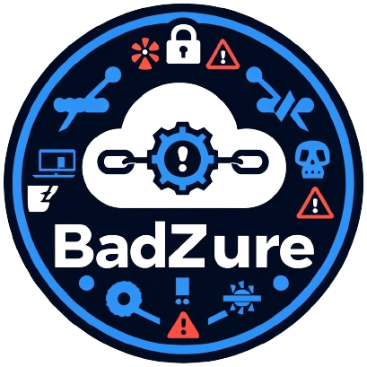

# BadZure
[](https://www.blackhat.com/us-24/arsenal/schedule/index.html#badzure-simulating-and-exploring-entra-id-attack-paths-39628)    [](https://blackhat.com/us-26/arsenal/schedule/#badzure-building-cloud-attack-labs-with-ai-52966)
[](https://twitter.com/OTR_Community)
[](https://www.badzure.com)

<div align="center">
    
</div>
<br>

BadZure deploys intentionally misconfigured Entra ID tenants and Azure subscriptions so security teams can explore, exploit, and detect cloud attack paths in a real environment. It uses Terraform to populate a tenant with users, groups, applications, and Azure resources, then layers deliberate misconfigurations on top to produce complete privilege-escalation paths that span the identity and infrastructure planes.

Every attack path begins at a compromised foothold and ends at a high-privilege target. BadZure provides the foothold credentials, so you start post-compromise and focus on the escalation itself.

**📖 Full documentation: [www.badzure.com](https://www.badzure.com/)**

## Who it's for

You might be one of these, or several:

- 🗡️ **Red teamers**: rehearse Entra ID and Azure tradecraft in a safe, disposable tenant.
- 🎯 **Detection engineers & threat hunters**: generate attack telemetry to build and validate detections.
- 🟣 **Purple teams**: reproduce a specific technique end to end and watch it from both sides.
- 🔬 **Security researchers**: explore cloud attack primitives and discover new ones.
- 🎓 **Trainers & CTF authors**: run practical cloud security labs and capture the flag challenges.

## Attack paths

BadZure provides two ways to author an attack path: **atomic** (one named technique template from a catalog of seven) and **chained** (an explicit graph built from lower-level primitives). A chained path can reproduce one catalog behavior or combine several into a custom route. The seven atomic templates span the identity plane (ApplicationOwnershipAbuse, ApplicationAdministratorAbuse, CloudAppAdministratorAbuse) and the resource plane (ManagedIdentityAbuse, KeyVaultSecretTheft, StorageCertificateTheft, CosmosDBSecretTheft). See the [technique catalog](https://www.badzure.com/attack-paths/techniques/) for details and interactive graphs of each.

## Quick start

### Requirements

- [Azure CLI](https://docs.microsoft.com/en-us/cli/azure/install-azure-cli) and [Terraform](https://learn.hashicorp.com/tutorials/terraform/install-cli)
- An Azure subscription with an Entra ID tenant. [Creating one](https://learn.microsoft.com/en-us/training/modules/create-an-azure-account/1-introduction) provides both. Azure compute resources incur standard charges until you `destroy` the lab.

### Install and run

```bash
git clone https://github.com/mvelazc0/BadZure
cd BadZure
python -m venv venv && source venv/bin/activate   # Windows: venv\Scripts\activate
pip install -r requirements.txt

# Deploying requires Global Administrator in Entra ID and Owner on the subscription.
az login

python BadZure.py check   --config badzure.yml   # prove attack paths reachable (offline)
python BadZure.py report  --config badzure.yml   # render interactive graphs (offline)
python BadZure.py build   --config badzure.yml   # deploy the lab
python BadZure.py show                           # inspect what was created
python BadZure.py destroy --verbose              # tear it all down
```

See [Installation](https://www.badzure.com/installation/) and [Your First Lab](https://www.badzure.com/first-lab/) for the full walkthrough, and the [Configuration reference](https://www.badzure.com/reference/tenant-baseline/) for every option.

## Author

* **Mauricio Velazco**, [@mvelazco](https://twitter.com/mvelazco)

## Contributors

* [Chan Huan Jun](https://www.linkedin.com/in/chan-huan-jun-50a704115/)
* [Manuel Melendez](https://www.linkedin.com/in/manuel-melendez-b62298238/)

## References

* [Cloud Katana](https://github.com/Azure/Cloud-Katana) by [Roberto Rodriguez](https://twitter.com/Cyb3rWard0g)
* [AADInternals](https://github.com/Gerenios/AADInternals) by [Nestori Syynimaa](https://twitter.com/DrAzureAD)
* [Azure Attack Paths](https://cloudbrothers.info/en/azure-attack-paths/) by [Fabian Bader](https://twitter.com/fabian_bader)
* [ROADtools](https://github.com/dirkjanm/ROADtools) by [Dirkjan Mollema](https://twitter.com/_dirkjan)
* [PurpleCloud](https://github.com/iknowjason/PurpleCloud) by [Jason Ostrom](https://twitter.com/securitypuck)
* [Azure AD Attack and Defense Playbook](https://github.com/Cloud-Architekt/AzureAD-Attack-Defense) by [Sami Lamppu](https://twitter.com/samilamppu) and [Thomas Naunheim](https://twitter.com/Thomas_Live)
* [BloodHound/AzureHound](https://github.com/BloodHoundAD/AzureHound) by [Andy Robbins](https://twitter.com/_wald0)

## License

This project is licensed under the Apache 2.0 License. See the [LICENSE](LICENSE) file for details.
