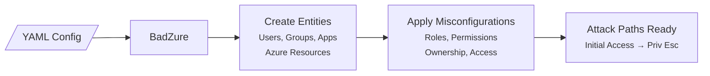

# BadZure

<div align="center">
    
</div>

**BadZure** is a Python tool that automates the creation of vulnerable Azure environments for security testing and training. It uses Terraform to populate Entra ID tenants and Azure subscriptions with realistic entities and intentional misconfigurations, producing complete attack paths that span identity and cloud infrastructure layers.

[](https://www.blackhat.com/us-24/arsenal/schedule/index.html#badzure-simulating-and-exploring-entra-id-attack-paths-39628)

---

## Why BadZure?

Setting up a realistic Azure environment with exploitable misconfigurations is tedious and error-prone. BadZure does it in minutes — and tears it down just as fast.

Each run creates a unique tenant populated with users, groups, applications, service principals, administrative units, and Azure resources (Key Vaults, Storage Accounts, Virtual Machines, Logic Apps, Automation Accounts, Function Apps). It then wires up privilege escalation paths using common misconfigurations seen in real environments: overprivileged application ownership, excessive administrative roles, exposed managed identity tokens, and leaked credentials in cloud storage.

## What Can You Do With It?

- **Red team exercises** — Practice Entra ID and Azure attack techniques against realistic environments
- **Detection engineering** — Generate attack telemetry across identity and infrastructure layers to build and test detections
- **Purple team operations** — Run collaborative exercises covering identity attacks and cloud-native compromise scenarios
- **Security training** — Facilitate hands-on Azure security workshops with pre-built attack paths
- **CTF events** — Host dynamic cloud security capture-the-flag competitions with multi-vector scenarios

## How It Works

BadZure reads a YAML configuration file, generates Entra ID entities and Azure resources via Terraform, and configures privilege escalation paths between them. Every attack path starts with a compromised identity (user or service principal) and ends at a high-privilege target.



## Supported Attack Paths

BadZure supports six privilege escalation techniques across two categories. To learn more about what attack paths are and how they emerge in cloud environments, see [What Are Attack Paths?](what-are-attack-paths.md).

### Identity-Based

| Attack Path | Description |
|---|---|
| [**ApplicationOwnershipAbuse**](attack-paths/app-ownership-abuse.md) | Exploit application ownership to add credentials to a privileged app |
| [**ApplicationAdministratorAbuse**](attack-paths/app-administrator-abuse.md) | Exploit the Application Administrator role to manage any app in the tenant |
| [**CloudAppAdministratorAbuse**](attack-paths/cloud-app-administrator-abuse.md) | Exploit the Cloud Application Administrator role — narrower scope than Application Administrator |
| [**ManagedIdentityTheft**](attack-paths/managed-identity-theft.md) | Steal managed identity tokens from Azure resources to pivot to other services |

### Resource-Based

| Attack Path | Description |
|---|---|
| [**KeyVaultSecretTheft**](attack-paths/keyvault-secret-theft.md) | Retrieve application secrets directly from Azure Key Vault |
| [**StorageCertificateTheft**](attack-paths/storage-certificate-theft.md) | Retrieve application certificates from Azure Storage |

## Quick Start

```bash
git clone https://github.com/mvelazc0/BadZure
cd BadZure
python -m venv venv && venv\Scripts\activate
pip install -r requirements.txt
az login
python badzure.py build
```

See the [Getting Started](getting-started.md) guide for full setup instructions.

