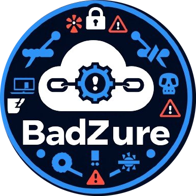
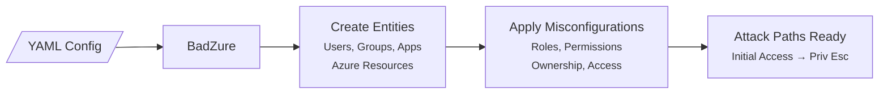

# BadZure

<div align="center">
    
</div>

BadZure automates the creation of intentionally misconfigured Entra ID tenants and Azure subscriptions for security exploration. It populates a tenant with realistic identities and Azure resources (users, groups, service principals, key vaults, storage accounts, virtual machines, and more) and randomly assigns Entra roles, Graph permissions, and resource access to mimic the organic permission sprawl of a real organization. The misconfigurations it introduces connect these identities and resources into exploitable attack paths.

[Cloud attack paths](attack-paths/explained.md) are the chains of everyday misconfigurations that let an attacker escalate from an initial foothold to higher-impact outcomes such as resource abuse, data exfiltration, or full tenant compromise. Attack paths can be hard to understand and defend against through conceptual analysis alone. BadZure turns them into something you can explore in live Azure tenants, seeded with the misconfigurations that create those paths, safe to attack and quick to rebuild.

[](https://www.blackhat.com/us-24/arsenal/schedule/index.html#badzure-simulating-and-exploring-entra-id-attack-paths-39628)    [](https://blackhat.com/us-26/arsenal/schedule/#badzure-building-cloud-attack-labs-with-ai-52966)


## Who it's for

You might be one of these, or several:

- 🗡️ **Red teamers**: rehearse Entra ID and Azure tradecraft in a safe, disposable tenant.
- 🎯 **Detection engineers & threat hunters**: generate attack telemetry to build and validate detections.
- 🟣 **Purple teams**: reproduce a specific technique end to end and watch it from both sides.
- 🔬 **Security researchers**: explore cloud attack primitives and discover new ones.
- 🎓 **Trainers & CTF authors**: run practical cloud security labs and capture the flag challenges.

## How It Works

BadZure reads a YAML configuration file, generates Entra ID entities and Azure resources via Terraform, and configures privilege escalation paths between them. Each attack path starts at an initial foothold, either a compromised identity or a foothold on an internet-exposed resource such as a VM or web app, and ends at a high-privilege target.


``` mermaid
graph LR
    CONFIG[/"YAML Config"/] --> BADZURE["BadZure"]
    BADZURE --> ENTITIES["Create Entities<br/><small>Users, Groups, Apps<br/>Azure Resources</small>"]
    ENTITIES --> MISCONFIG["Apply Misconfigurations<br/><small>Roles, Permissions<br/>Ownership, Access</small>"]
    MISCONFIG --> PATHS["Attack Paths Ready<br/><small>Initial Access → Priv Esc</small>"]


```

## A first attack path

Consider the following scenario: A developer account, `dave.park`, is compromised. It holds nothing obviously dangerous, only access to a Key Vault. But that vault stores the client secret of `hr-sync`, an application with the Global Administrator role. The attacker reads the secret, authenticates as `hr-sync`, and turns one ordinary developer account into full control of the tenant.

The graph below is a live BadZure lab, not a picture. Drag it.

<iframe class="bz-graph" src="/reports/intro.report.html?embed=attack-keyvault_to_ga" title="A first attack path: Key Vault secret theft to Global Administrator" loading="lazy"></iframe>

<small class="bz-graph-caption"><a href="/reports/intro.report.html" target="_blank" rel="noopener">Open the full lab report ↗</a></small>

This is one example of what BadZure can deploy in minutes. Explore the full catalog in [Cloud Attack Paths](attack-paths/explained.md), and see [How to Read These Graphs](attack-paths/reading-graphs.md) for the colors and line styles.

## Quick start

```bash
git clone https://github.com/mvelazc0/BadZure
cd BadZure
python -m venv venv && source venv/bin/activate   # Windows: venv\Scripts\activate
pip install -r requirements.txt
az login
python BadZure.py build
```

See [Installation](installation.md) for full setup and [Your First Lab](first-lab.md) for a guided walkthrough.
